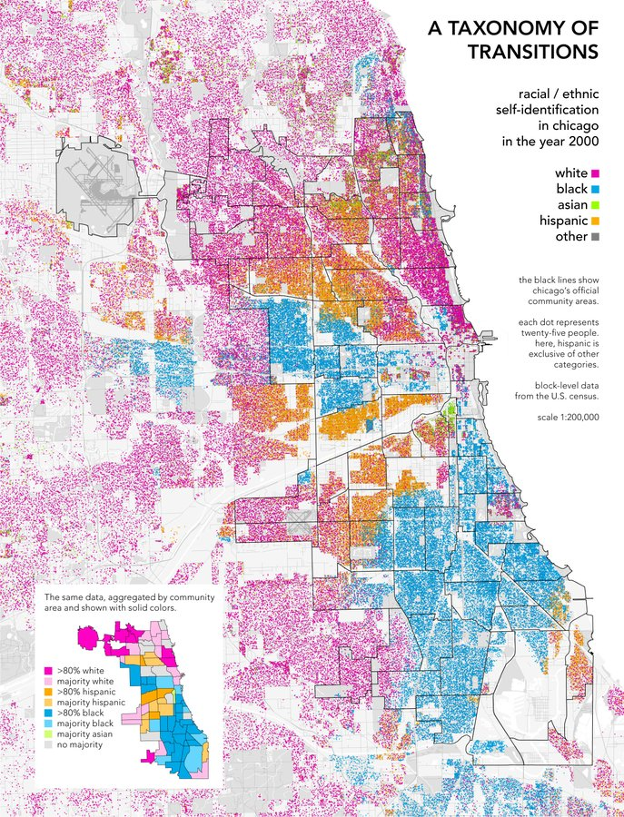

Ciao a tutti, facciamo un altro Twitter-torial sulle mappe!
L'argomento di oggi è visualizzazione di dati aggregati. Si tratta per lo più di una critica su [questa mappa](https://www.arcgis.com/apps/opsdashboard/index.html#/bda7594740fd40299423467b48e9ecf6), che probabilmente avrete visto circolare un bel po'. È una mappa che mostra dati importanti! Ma ho qualche problema con le tecniche utilizzate.

https://twitter.com/user/status/1238556851643518981

Conosciamo tutti le mappe che visualizzano dati aggregati. La più nota tra tutte probabilmente è la mappa coropletica: una mappa che mostra aree geografiche riempite con un colore o un motivo per rappresentare informazioni relative a queste aree.
Un esempio è questa elettorale della BBC:

https://twitter.com/user/status/1238556851643518981

I colori sulla mappa rappresentano delle informazioni: ad esempio, quale partito ha vinto le elezioni in un distretto e con quale percentuale. Le mappe coropletiche presentano dei problemi (problemi spesso legati alle ipotesi fatte su aree geografiche estese), ma sono comunque utili per mostrare dati aggregati a livello di area.

https://twitter.com/user/status/1238559830828253186

Esistono altri due modi comuni di visualizzare dati aggregati: mappe a densità di punti e mappe a simboli graduati. Le mappe a mappe a densità di punti usano un punto per rappresentare un numero di cose che si vogliono mappare, e raggruppano i punti in un’area geografica.
Ecco un esempio di Bill Rankin (2009):

https://twitter.com/user/status/1238560988619816963

Ciascun punto rappresenta 25 persone nella città di Chicago. Ciascun punto, però, non fornisce la locazione geografica precisa di quelle 25 persone, ma piuttosto una posizione del tutto casuale dentro l’area geografica di interesse (assieme agli altri punti che appartengono alla stessa area geografica). Interessante, no? È di certo un modo carino per raccontare una storia.

https://twitter.com/user/status/1238561449351557122

Esistono poi anche mappe a simbolo graduato (anche note come mappe a simboli proporzionali). Queste mappe usano un simbolo (comunemente un cerchio) per rappresentare un’area geografica, e la dimensione e/o il colore del simbolo ha una qualche relazione con una dimensione dei dati che si vogliono visualizzare. Un esempio: la mappa della diffusione del coronavirus sviluppata dall'istituto Johns Hopkins.

https://twitter.com/user/status/1238562354239078401

Nel caso specifico di questa mappa, ciascun punto rappresenta uno stato/provincia o Paese (dipende dalla regione geografica, in US si parla di stati), e il raggio del cerchio di ogni punto ci dice quanti casi di coronavirus sono stati confermati in quell’area geografica. (Da notare che la scala non è lineare, ma logaritmica!)

https://twitter.com/user/status/1238563186707697664

Cosa ci vuole dire questa mappa? Lo scopo di questa mappa sembra voler essere quello di visualizzare (e quindi informare l’utente su) il numero totale dei casi di COVID-19 nel mondo. La domanda è: ci riesce? La risposta? Sì e no. Ecco alcune mie critiche su questa mappa:

https://twitter.com/user/status/1238563754922643458

Conoscere il numero totale di casi in una determinata area geografica è utile. Conoscere il numero totale di casi entro una specifica area politica… forse un po’ meno. Se io vivo al confine tra Washington e Oregon (facciamo a Portland), quel confine di stato per me non ha molto significato…

https://twitter.com/user/status/1238564009672085510

In termini di contenimento e misure adottate da uno specifico stato, sembra essere utile sapere quanti casi ci sono in uno stato. Da un punto di vista epidemiologico, però, ai virus non importa granché di confini di stato. Si parla infatti di un concetto chiamato il "problema dell'unità’ d’area modificabile".

https://twitter.com/user/status/1238564199128879105

The Modifiable Areal Unit Problem is about how changing boundary areas can fully change the results of a spatial analysis. This leads to an ecological fallacy: the idea that these borders matter when it comes to this data. (For more, this Twitter-torial: https://t.co/brI7I1xTsD)

https://twitter.com/user/status/1238564846574145536

La mia modesta opinione, quindi, è che mostrare il numero di casi per area geografica è utile, ma solo in termini di risposta ufficiale di quell’area geografica (risposta ai dati che si stanno interpretando).

https://twitter.com/user/status/1238565387647754241

Quella di cui stiamo parlando è una mappa slippy, il che significa che posso scorrere, ingrandire e rimpicciolire. Una cosa molto utile! Posso quindi zoomare sulla mia città per vedere se ci sono casi riportati. Vivo a New York, dove so che ci sono casi. Ma cosa succede quando vado a zoomare?

https://twitter.com/user/status/1238565819916922880

Non trovo niente! E sapete perché? Perché il simbolo graduato che rappresenta il numero di casi nello stato (stato=area geografica) è situato nel centroide geografico dello stato, triangolato approssimativamente tra Binghamton ed Oneonta.

https://twitter.com/user/status/1238566350383169541

Il centroide di un’area è la posizione media di tutti i suoi punti -- non è proprio il “centro” dell’area, ma ci si avvicina. Se stessimo parlando di una mappa di stampa, tutto ciò’ avrebbe molto più senso. È molto più’ semplice capire cosa succede quando facciamo uno zoom out! Ma.. se io non sapessi cosa sono i simboli graduati, se non sapessi come vengono costruite queste mappe, e quale messaggio cercano di trasmettere… assumerei che NYC non abbia nessun caso di COVID-19 e che tutti i casi di New York sono concentrati intorno alla città di Downsville, New York. Del resto è lì che si trova il marker!

https://twitter.com/user/status/1238566716034232320

Inoltre, i simboli graduati scompaiono quando si fa uno zoom oltre il livello 7. Questo vuol dire che, anche se credessi che tutti i casi di New York fossero localizzati in quell’area, lì, non saprei nemmeno di preciso dove si trova questo “lì”, perché i simboli scompaiono prima che riesca ad arrivare a vedere la zona con la giusta risoluzione.

https://twitter.com/user/status/1238567378461622273

Dunque, come possiamo rendere questa mappa più chiara? Quali accorgimenti può prendere un cartografo per raccontare questa storia in un modo più efficace e corretto?

https://twitter.com/user/status/1238567667935690752

Un’opzione è quella di impostare dei limiti allo zoom. Semplicemente non lasciare che l’utente rimpicciolisca la visualizzazione oltre un certo limite. Questa impostazione fa capire all’utente che non ci sono dati disponibili oltre un certo livello di risoluzione, e allo stesso tempo chiarisce che i simboli rappresentano un dato aggregato.

https://twitter.com/user/status/1238567978691702784

Onestamente, però, non riesco a capire del tutto che cosa stia cercando di mostrare o di raccontare questa mappa. Mostrare i casi confermati aggregati per stato o nazione non mi sembra una cosa molto utile. Piuttosto, che andamento hanno i casi nel tempo? Come potremmo visualizzare questo andamento? E le statistiche aggiustate per popolazione?

https://twitter.com/user/status/1238568410239377409

Sono consapevole che questi dati sono freschi e non sappiamo di preciso quanto siano affidabili, e so che è importante ottenere quanta più informazione possibile che ci aiuti a capire che cosa sta succedendo. Il problema è che tutte queste mappe sono rischiose perché raccontano una storia sbagliata.

https://twitter.com/user/status/1238568692050464768

Un consiglio generale: quando si aggregano dei dati, bisogna per forza di cose sottrarre dettagli e sfumature. È nostra responsabilità, come cartografi assicurarci di farlo in modo responsabile ed etico, in particolare condividendo la metodologia che adoperiamo e spiegando i risultati che otteniamo.

https://twitter.com/user/status/1238569235711959051

Inoltre, saper leggere una mappa è importante ed è una cosa che dobbiamo continuare ad insegnare e trasmettere, anche nell’era di Google Maps. Le mappe sono strumenti storici di oppressione e spetta a noi essere critici della visualizzazione dei dati di tutti i tipi, piuttosto che accettarla come un dogma.

https://twitter.com/user/status/1238569653770780673
